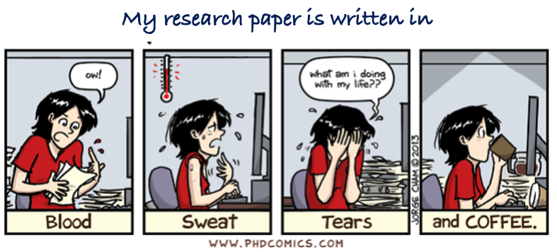

# Importance of the methods section

## It provides information to judge a study's validity

- It requires a  description of how an experiment was done 

- It explains why the specific experimental procedures were selected

- It should describe what was done to answer the research question

- Describe how it was done, and explain how the results were analyzed. 

## Methodology Section for Research Papers

[Sample Quantitative Methodology](https://www.sjsu.edu/writingcenter/docs/handouts/Methodology.pdf)

# How to evaluate a research paper

##  Summary

Check that it includes:

- Statement of topic and purpose
- Description of the study area and data
- Explanation of analytical methodology 
- Summary of results and implications

## Introduction 

- Is the context for the study clear?
- Is there a research problem?
- Is there a synthesis of the state of art?
- Are research questions clear and meaningful?

## Literature review

- Is there a focused conceptual framework?
- Is there a critical synthesis of previous studies?
- Is there an statement of the approach adopted for the paper?

## Methods

- Is the description of the experimental design clear?
- Is there a workflow diagram which illustrates data processing?
- Is there a detailed description of each stage? 
- Is the information analysis complete? 

## Results

- Are the outputs of all stages described?
- Does the author include figures and tables?
- Is there consystency between this section and the previous one?

## Discussion

- Is(are) the  research question(s) answered?
-  Are the hypotheses supported or rejected?
- Is there an explanation of why the results were as they were?
- Are advantages and limitations of the study mentioned?
- Are there contributions for geomatics described?

## References

-  Are all references cited in the text included?
-  Are any pertinent references missing?

# Examples of high-quality papers 

- [Field-Scale Rice Area and Yield Mapping in Sri Lanka](https://www.mdpi.com/2072-4292/17/17/3065)

- [Improved landslide susceptibility assessment](https://www.sciencedirect.com/science/article/pii/S1470160X24014055)

- [Combining GEDI and Sentinel-2 for mapping of crops](https://iopscience.iop.org/article/10.1088/1748-9326/ac358c/pdf)

# 

# How to respond to reviewers?

[Ten simple rules](https://journals.plos.org/ploscompbiol/article?id=10.1371/journal.pcbi.1005730)

[Responding to reviewers](https://ltl.lincoln.ac.nz/assets/Uploads/Learning-and-Research-Skills/Presenting-your-research/Responding-to-reviewers.pdf)

[Hidden Submission Patterns](https://www.science.org/doi/10.1126/science.1227833)

## Questions?

